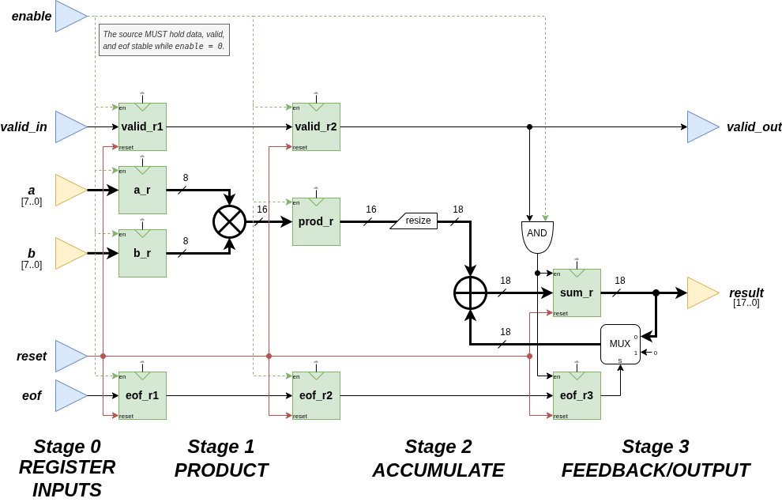

# pipelined-mac-core

A small, accelerator-style multiply–accumulate (MAC) compute core designed as a pipelined RTL block.
The repository contains a VHDL implementation and a SystemVerilog port on separate branches.



## Features (design overview)

- Signed 8-bit operands (`a`, `b`) with a wider signed accumulation/result path.
- Multi-stage pipeline intended to keep combinational paths short.
- Control signals intended for streaming/batch-friendly use:
  - `enable`: stalls the pipeline (the source must hold inputs stable while stalled).
  - `valid_in`: marks whether current inputs contribute to the accumulation.
  - `eof`: marks end-of-frame (finalize an accumulation frame without inserting idle cycles).
  - `valid_out`: indicates when the result is valid/available.

> Note: This is a compact educational/portfolio-grade core focused on clean RTL structure and reproducible simulation, not a full production IP with CDC/FIFOs/backpressure buffering.

## Repository layout

The exact file set depends on the branch, but the intended structure is:

```bash
rtl/ # synthesizable RTL
tb/ # testbenches
sim/ # simulator build output (ignored by git)
docs/ # short design notes and interface contracts
scripts/ # build/run helpers (if used)
```

## Branches

- `vhdl`  
  VHDL-2008 implementation with a VHDL testbench and a GHDL-based simulation flow.

- `systemverilog`  
  SystemVerilog implementation (idiomatic `always_ff` / `always_comb`) with a Verilator-based simulation flow.

## Quick start (VHDL branch)

### Prerequisites

- GHDL (VHDL-2008 capable)
- A waveform viewer (optional), e.g. GTKWave

### Run simulation

From the repository root:
```bash
make sim
```
Expected outcome:
- The build completes without errors.
- The simulation prints a clear PASS/FAIL.
- Optionally, a waveform file is emitted (if enabled in the Makefile/testbench).

### View waveform (optional)
```bash
gtkwave mac_sim.vcd
```

## Quick start (SystemVerilog branch)
### Prerequisites
- Verilator (recent version recommended)
- A C++ compiler toolchain (e.g., GCC/Clang)
- Make

### Run simulation
From the repository root:
```bash
make sim
```
Expected outcome:
- The build completes without errors.
- The simulation prints a clear PASS/FAIL.
- Optionally, a waveform file is emitted (if enabled in the Makefile/testbench).

## Build targets
Both branches should aim to provide:

- `make sim` — build + run simulation
- `make clean` — remove generated build artifacts
- `make wave` — optional convenience target to open the waveform (if a viewer is available)

## Design contracts and assumptions
To keep the RTL simple and synthesizable, the following assumptions typically apply:

- When `enable = 0` (stall), the input source holds `a`, `b`, `valid_in`, and `eof` stable until `enable` returns to 1.
- Only cycles with `valid_in = 1` contribute to accumulation.
- `eof = 1` denotes the final sample of the current accumulation frame.

The testbench(s) should explicitly check these behaviors and the latency/valid alignment of `valid_out`.

## Roadmap
- Assertions (SV immediate assertions first, then SVA properties)
- More systematic self-checking (randomized vectors + golden reference)
- Optional: ready/valid streaming wrapper + buffering (FIFO/backpressure) as an extension

## License

GPL-2.0-or-later. See LICENSE.